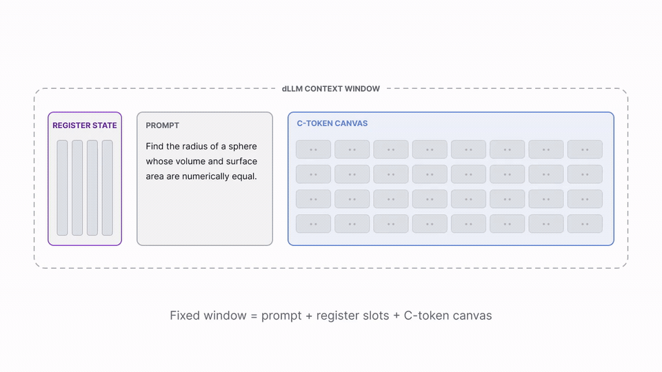

<div align="center">
  <h1>Register Tokens for Bounded-State Reasoning in Diffusion Language Models</h1>
  <p>
    A trained, fixed-size <i>continuous</i> channel for carrying decoding state across context resets in diffusion LLMs.
  </p>
</div>

<div align="center">

  <a href="https://github.com/lbertge/dllm-registers-reasoning"></a>
  <a href="https://huggingface.co/collections/albertge/dllm-registers-6a2e409ed8c60039981a229c"></a>
  <a href="https://huggingface.co/datasets/albertge/mix60k-math-code-sft"></a>
</div>

## What this is

Diffusion language models decode in **denoising windows**. We study whether they can continue a multi-block generation after each completed text block is cleared, using only a fixed-size carried state.

**Register tokens** are a small, fixed set of positions whose hidden states the model is trained to *write* during one chunk and *read* during the next. Between chunks we clear the generated text from the active context but preserve the original prompt and registers, so successive chunks communicate through a bounded continuous channel rather than through a growing prefix. The completed chunks are concatenated for the final output.

<p align="center">
  <a href="registers_demo.mp4">
    
  </a>
</p>

<p align="center">
  <a href="registers_demo.mp4">Watch the full-quality demo (MP4)</a>
</p>

This release includes inference examples for LLaDA and Dream, the main supervised-fine-tuning recipes, 16 checkpoint aliases, and six math/code benchmarks. Start with a trained checkpoint; training is not required to try the method.

## Setup

Use Linux and Python 3.11. Create an environment, then install a GPU build of PyTorch using the [official CUDA/ROCm installation instructions](https://pytorch.org/get-started/locally/).

```bash
git clone https://github.com/lbertge/dllm-registers-reasoning.git
cd dllm-registers-reasoning
python3 -m venv .venv
source .venv/bin/activate
# Install the appropriate PyTorch wheel before the remaining requirements.
pip install -r requirements.txt
```

The Python stack pins Transformers 4.49.0 and Accelerate 1.4.0. The CPU test suite also runs with PyTorch 2.6.0; use a PyTorch build compatible with your accelerator. The 7B/8B checkpoints need roughly 14–16 GB for BF16 weights alone, plus activations and temporary buffers. Full-model training requires substantially more memory than inference.

Checkpoint weights and the training dataset are public; no API key is required. Downloads use the usual Hugging Face cache. Dream requires `--trust-remote-code`, which permits Python code from the selected model repository to run: inspect that code before opting in. The LLaDA examples use the local model implementation.

## Try a checkpoint

Math, with four continuous registers and 128-token completion windows:

```bash
python inference.py --checkpoint llada-math-registers \
  --prompt "A shop has 24 pencils, sells 7, then receives 10. How many remain?"
```

Dream, with the same carry layout:

```bash
python inference.py --checkpoint dream-math-registers --trust-remote-code \
  --prompt "Three consecutive integers sum to 72. What is the largest?"
```

Code, with 64-token completion windows:

```bash
python inference.py --checkpoint llada-code-registers \
  --prompt "Write a Python function unique_in_order(items) that removes duplicates while preserving order."
```

Each example prints the successive chunks. The code demo only generates text; it does not execute the program. Use `--reset-state` to disable carry, or select a discrete-text or memory-token checkpoint below. A raw Hugging Face ID or local checkpoint path is also accepted; supply its layout explicitly, for example:

```bash
python inference.py --checkpoint outputs/my-registers/final_model \
  --channel registers --slots 4 --chunk-size 128 --max-chunks 8
```

`C=128` means **128 completion positions**, not a 128-token limit including the prompt. The active read window contains the prompt, carry slots, and at most C completion positions. The default total generation budget is 1,024 tokens. See [the inference and evaluation protocol](docs/evaluation.md).

## Checkpoints

Aliases select an immutable checkpoint revision and its carry layout, window size, and denoising precision. Full model IDs and revision hashes are in [configs/checkpoints.json](configs/checkpoints.json).

| Training method | LLaDA math | Dream math |
| --- | --- | --- |
| Task-trained registers | [llada-math-registers](https://huggingface.co/albertge/llada-8b-dllm-registers-mix60k-r4-corrected) | [dream-math-registers](https://huggingface.co/albertge/dream-7b-dllm-registers-mix60k-r4) |
| Discrete text | [llada-math-discrete](https://huggingface.co/albertge/llada-8b-dllm-registers-mix60k-t4) | [dream-math-discrete](https://huggingface.co/albertge/dream-7b-dllm-registers-mix60k-t4) |
| Reconstruction-trained memory | [llada-math-memory](https://huggingface.co/albertge/llada-8b-dllm-memory-tokens-mix60k-recon-w005) | [dream-math-memory](https://huggingface.co/albertge/dream-7b-dllm-memory-tokens-mix60k-recon-w005) |
| Full-sequence SFT, no carry | [llada-math-sft](https://huggingface.co/albertge/llada-8b-full-sft-mix60k-4pass) | [dream-math-sft](https://huggingface.co/albertge/dream-7b-full-sft-mix60k-4pass) |

Replace `math` with `code` for each method's code-continuation checkpoint. Math aliases use C=128 and up to 8 chunks; code aliases use C=64 and up to 16. Registers, memory, and discrete text each have four carry slots. Memory and registers share the inference algorithm; their training objectives differ.

## Evaluation

Start with a small subset:

```bash
python eval/eval.py --checkpoint llada-math-registers --dataset gsm8k \
  --limit 10 --output outputs/gsm8k-smoke.json
```

Omit `--limit` for a full benchmark. Available datasets are `gsm8k`, `gsm_hard`, `math` (MATH500), `omni_math_easy`, `humaneval`, and `mbpp`. Code evaluation executes generated programs and requires an explicit opt-in; run it only in an isolated, credential-free environment. See [evaluation instructions](docs/evaluation.md) for code commands and scoring details.

## Training

The [training guide](docs/training.md) covers data, register/discrete/memory/full-SFT recipes, and code continuation. For a command preview that neither downloads a model nor starts training:

```bash
python train.py --method registers --data data/mix60k.jsonl \
  --output outputs/my-registers --dry-run
```

External experiment tracking is off by default. All commands use paths you supply; data, weights, and outputs are excluded from Git. The launcher refuses an existing output directory.

## Tests

These tests require no trained checkpoint or GPU:

```bash
pip install -r requirements-dev.txt
python -m pytest -q
```

They cover bounded-window carry, stopping and first-answer scoring, training-command construction, reconstruction gradient routing, checkpoint publication, and a tiny LLaDA forward/backward pass. Full 7B/8B inference and distributed training are not covered by these CPU tests.

## Code layout

```text
inference.py                 Chunk-by-chunk demo and shared inference loop
train.py                     SFT recipe launcher; supports --dry-run
configs/checkpoints.json     Public checkpoint aliases and pinned revisions
SFT/                         Chunked and full-sequence SFT implementations
SFT/models/                  Local LLaDA implementation
eval/                        Denoising, benchmark prompts, and scoring
scripts/download_data.py     Public training-data downloader
tests/                       Small, offline protocol tests
docs/                        Training and evaluation instructions
```

## License and acknowledgments

Project code is provided under [Apache 2.0](LICENSE), subject to the upstream notices in [THIRD_PARTY.md](THIRD_PARTY.md). Model weights and datasets retain their own licenses. This work builds on LLaDA, Dream, and d1; please also credit those projects when using their models or methods.
